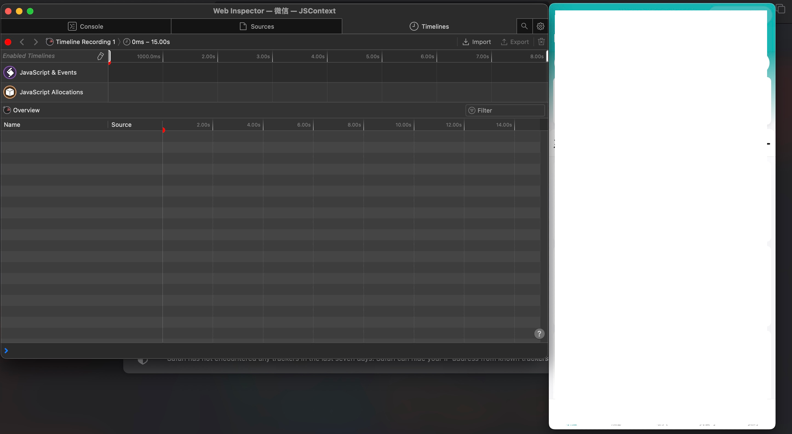

## 功能
源码：[github.com/ac0d3r/wxapkg](https://github.com/ac0d3r/wxapkg)
- unpack *.wxapkg
- list WeChat *.wxapkg files
- debug webview with Safari(16.4+)

## 安装

- **Go**安装：

```bash
$ go install github.com/ac0d3r/wxapkg/cmd/wxapkgx@latest
```

- 源码安装：

```bash
$ git clone git@github.com:ac0d3r/wxapkg.git
$ cd wxapkg
$ make
```


## 使用

### 解包

```bash
$ wxapkgx unpack --in xx.wa --format --v
[+] unpacking tests/__APP__.wxapkg -> ./unpack_out 
    file:/app-config.json, content-length:122727
    file:/assets/img/atta.png, content-length:689
    file:/assets/img/back_top.png, content-length:2467
    file:/assets/img/back_top_black.png, content-length:802
    file:/assets/img/close.png, content-length:1435
    file:/assets/img/default-company-logo.png, content-length:965
    file:/assets/img/female-press.png, content-length:2364
    file:/assets/img/female.png, content-length:1867
```

### 列出微信小程序包

```bash
$ wxapkgx list
[*] only support WeChat version 3.8.*
list /Users/x/Library/Containers/com.tencent.xinWeChat/Data/.wxapplet/packages/
    /Users/x/Library/Containers/com.tencent.xinWeChat/Data/.wxapplet/packages/wx23333
        /Users/x/Library/Containers/com.tencent.xinWeChat/Data/.wxapplet/packages/wx23333/520
        /Users/x/Library/Containers/com.tencent.xinWeChat/Data/.wxapplet/packages/wx23333/520/__APP__.wxapkg
        /Users/x/Library/Containers/com.tencent.xinWeChat/Data/.wxapplet/packages/wx23333/520/_subpackage_test_.wxapkg
```

### 调试
> 没有采用 `frida-go`，不想在执行文件中嵌入一个臃肿 `.a` 文件。

1. Safari 在首选项中启用 WebInspector(Develop)
    
    OR: 下载 [Safari Technology Preview](https://developer.apple.com/safari/technology-preview/)

2. 关闭SIP；（在 Apple Silicon 上除了关掉 sip，还需要开启 am64e abi，然后重启。）

```bash
$ sudo nvram boot-args="-arm64e_preview_abi"
```

3. pip安装frida

```bash
$ pip3 install frida
```

4. 运行 cmd/debug/debug.py

```bash
$ python3 cmd/debug/debug.py
Patching 小程序 (4613)
Patching 微信 (4607)
Patching 微信 (4606)
```
